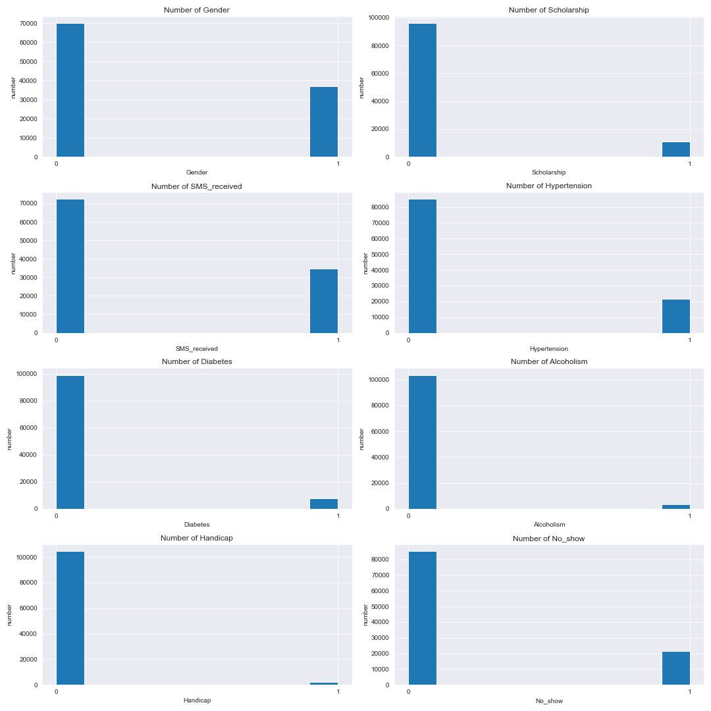
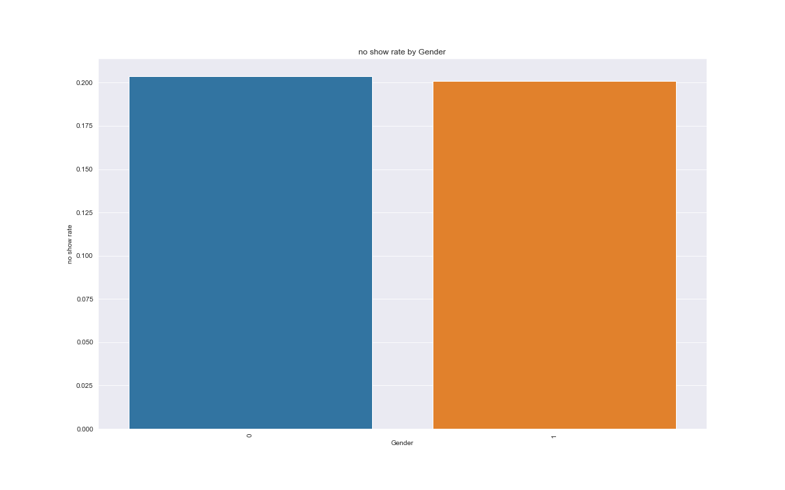
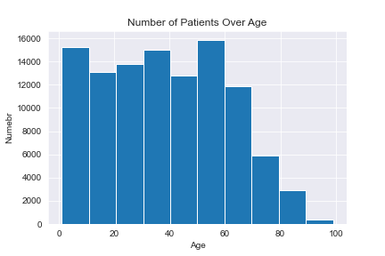
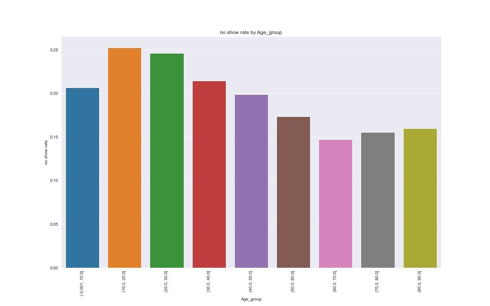
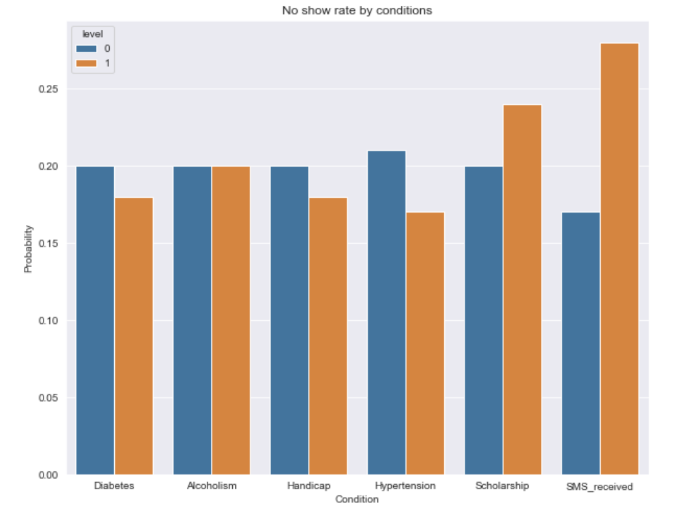
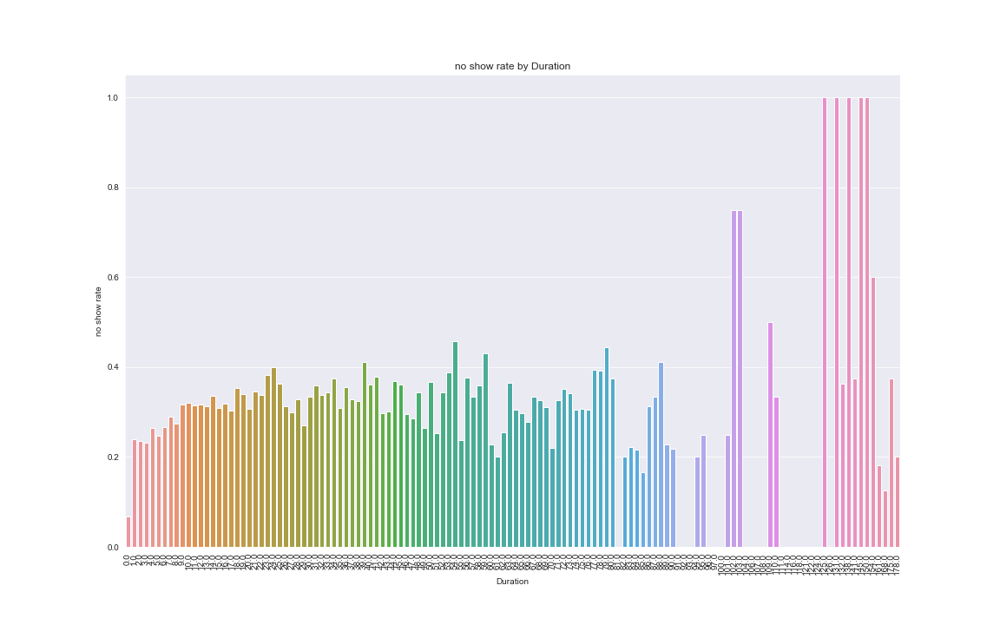
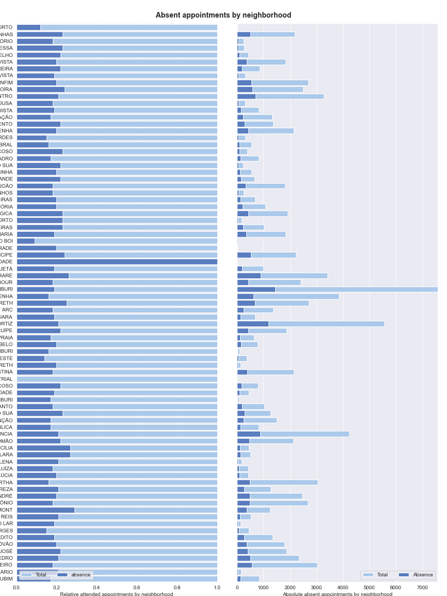
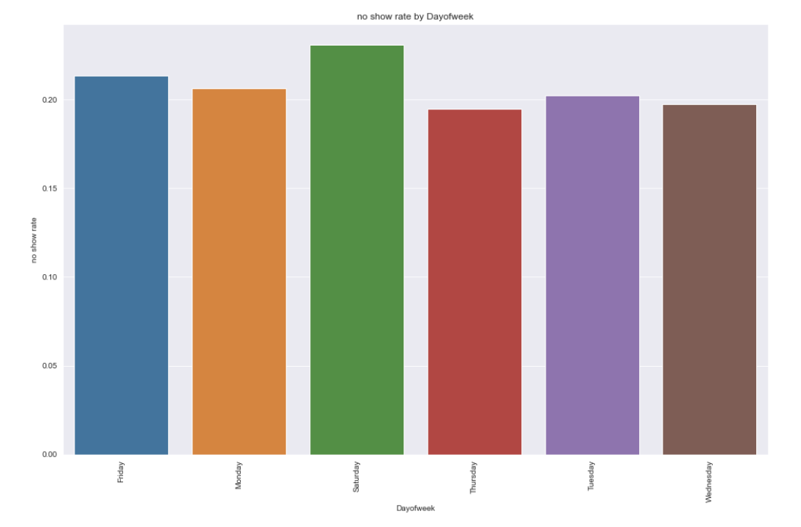

# Medical Appointment No-show Analysis
## By Murong (Sophie) Cui

## Introduction

> This dataset collects information from 100k medical appointments in Brazil and is focused on the question of whether or not patients show up for their appointment. A number of characteristics about the patient are included in each row.

## Data Cleaning
1. convert the data type
> After investing the data type for each columns, I convert the columns 'ScheduledDay' and 'AppointmentDay' to datetime data type.
2. assign new columns
> I assign a new column 'Duration', which represents the day difference between the appointment day and the day scheduled the appointment. 
It seems like there are some appointment that is scheduled at the same day, we can prevent that value by setting the same day scheduled to 0.  
And also assigning the column 'DayofWeek' to show which day of week for the appointment day.
3. rename the columns
> There are some column name in Spanish, convert them to English.
4. check erroneous data/ missing data
> Age: There is on missing values in the dataset. And one record has negative age. Therefore I drop the error record. And these are 7 patients are more than 100 years old, which considered as outliers. I drop these appointments as well.  
> For Handicap: in the data description, it is said that the handicap attribute should be boolean. However, the handicap assumes values from 0 to 4. I map 0 to 0 and else to 1
5. Convert the dummy variable to numeric variable

## Exploratory Data Analysis

### Research Question:
What factors are important for us to know in order to predict if a patient will show up for their scheduled appointment?

1. Overall, we could see that out of 106987 reservations around 21680 of them have turned no show and that's around 20%

2. Gender:
   - Below we can see out of the 106987 appointments, there are 70118 female patients and 36869 male patients.
   - The ratio of Females to Males that have turned up looks similar to those who have not come for the visit.
   - So gender may not play an important role in determining if a patient comes for a visit or not.

3. Age:
   - Age seems to influence negatively to no show rate at the age of 10 - 70 years. From age of 70 to age of 100, age shows positively influences to no show rate.
   - The age of 110-120 has highest no show rate, regrading the number of patients in this age range is small (7), it is reasonable to consider this age interval as outlier.

4. Condition: (Diabetes, Alcoholism, Handicap, Hypertension, Scholarship, SMS_received)
   - Having Diabetes, Handicap and Hypertension slightly decrease the no show rate.
   - Alcoholism has no influence to no show rate
   - Enrolling the scholarship increases the no show rate.
   - SMS_received: there are 72402 appiontments not received SMS and ouot of them around 16.7% are no show. Out of 34585 appointments which have received SMS around 27.66% of them did not show up. As we can see a clear distinction between people receiving SMS that was received and not receiving SMS, this feature will help us in determining of a patient will turn up for the visit after taking an appointment.

5. Duration: the numbers of days between the scheduling  date and appointment date
   - When the duration is longer than 100 days, the no show rate dramatically increases.

6. Neighborhood:
   - As most of neighborhoods have aroud 80% show rate. However, the neighborhood of ILHAS OCEÂNICAS DE TRINDADE has 100% no show rate, and the neighborhood of PARQUE INDUSTRIAL has 0% no show rate, and these two neighborhood carries the lowest number of appointment.

7. Day of week:
   - Friday and Saturday have the highest no show rate.

